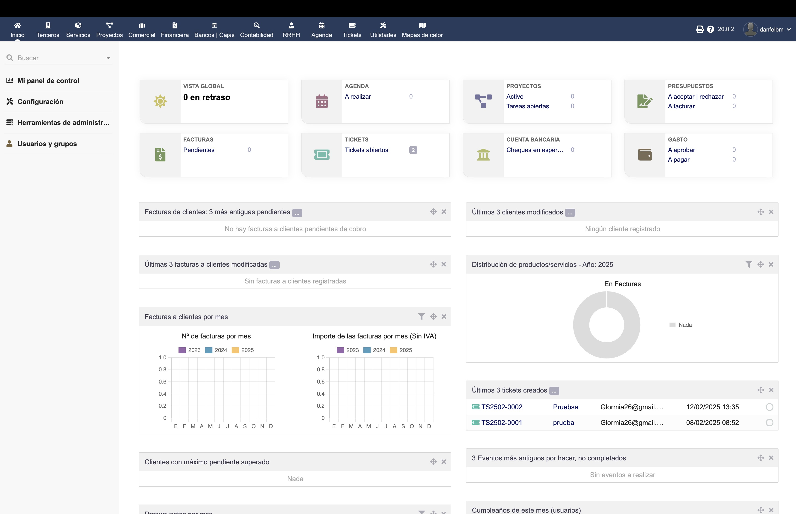
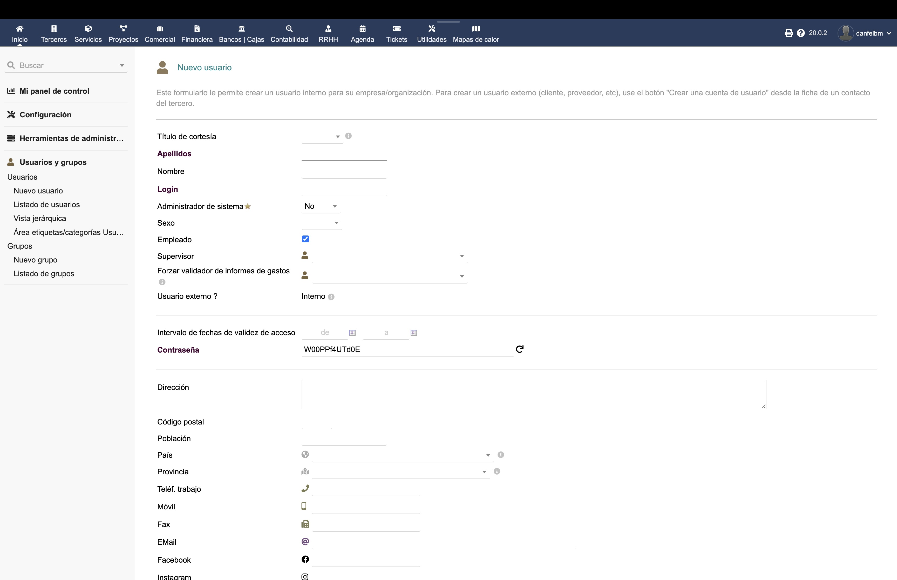
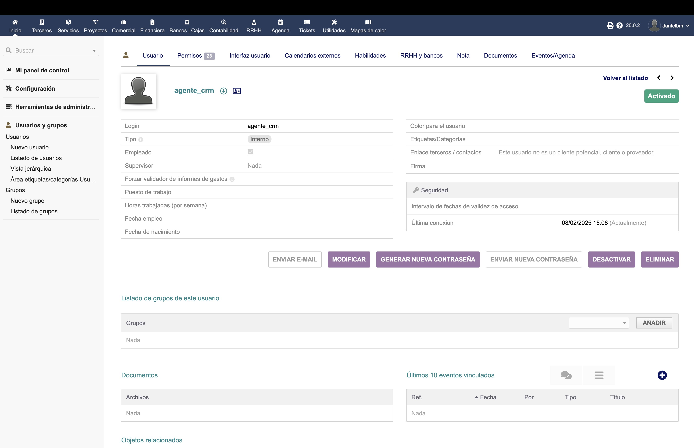
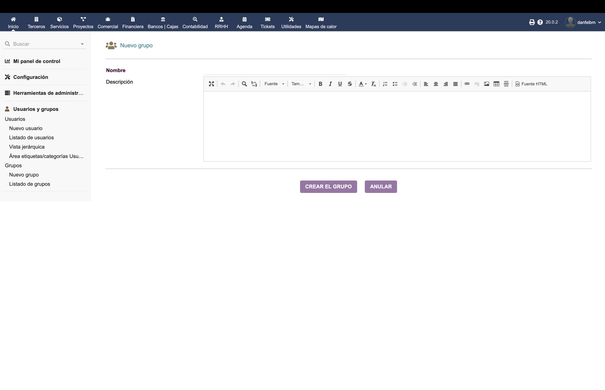
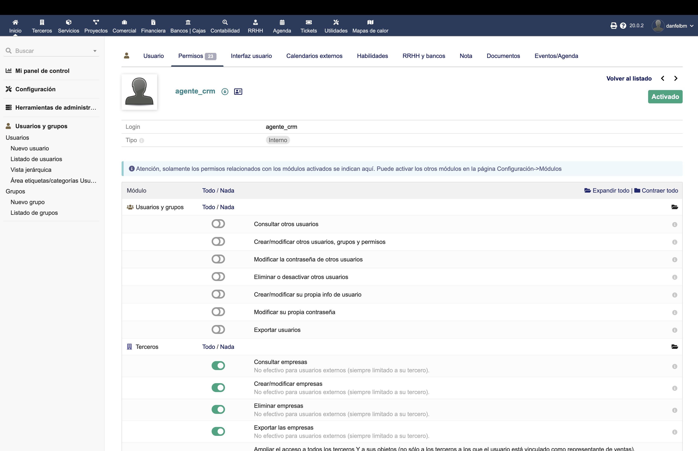
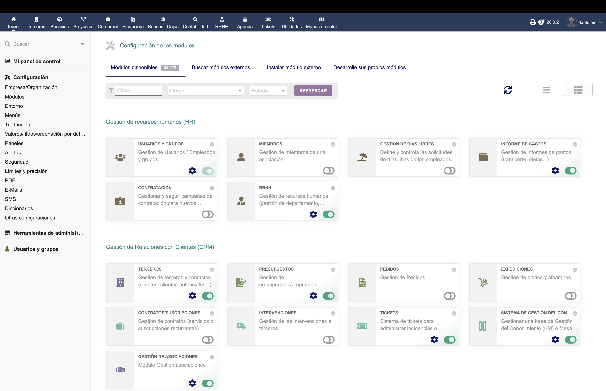
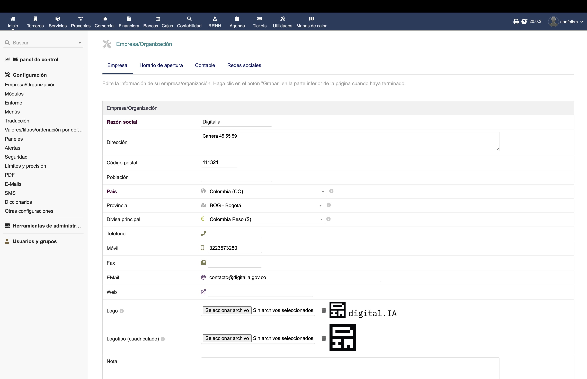
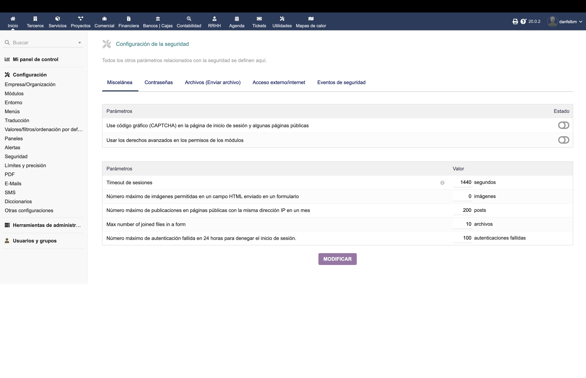
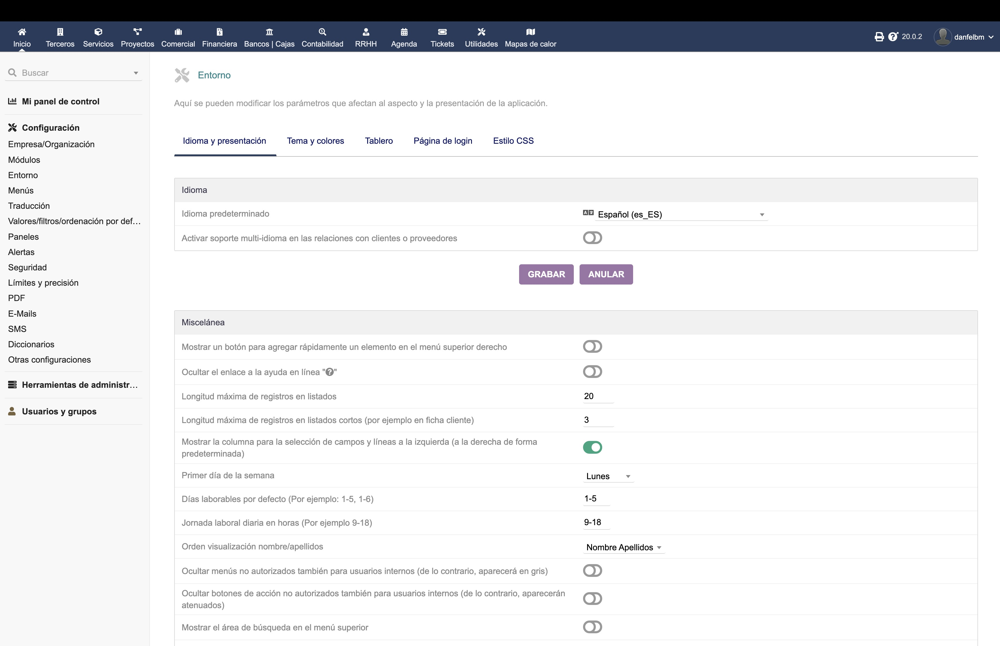
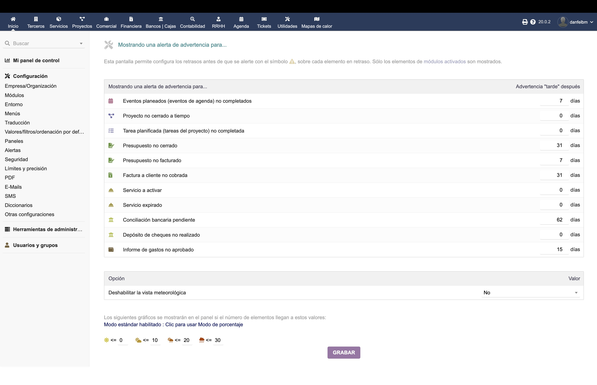

# Manual de Administrador - Configuración del Sistema Dolibarr

## Tabla de Contenidos

1. [Introducción](#introducción)
2. [Gestión de Usuarios y Permisos](#gestión-de-usuarios-y-permisos)
   - [Usuarios del Sistema](#usuarios-del-sistema)
   - [Grupos de Usuarios](#grupos-de-usuarios)
   - [Gestión de Permisos](#gestión-de-permisos)
3. [Activación y Configuración de Módulos](#activación-y-configuración-de-módulos)
4. [Configuración General del Sistema](#configuración-general-del-sistema)
   - [Configuración de la Empresa](#configuración-de-la-empresa)
   - [Configuración de Seguridad](#configuración-de-seguridad)
   - [Configuración de Interfaz](#configuración-de-interfaz)

## Introducción

Este manual está diseñado específicamente para administradores del sistema Dolibarr, enfocándose en las tareas de configuración y administración del sistema. Aquí encontrarás las instrucciones para gestionar usuarios, permisos, módulos y configuraciones generales del sistema.

## Gestión de Usuarios y Permisos

### Usuarios del Sistema

#### Crear Nuevo Usuario
1. Ve a "Inicio" > "Usuarios y Grupos" > "Nuevo Usuario"
2. Completa la información básica:
   - Nombre de usuario (login)
   - Nombre y apellidos
   - Contraseña
   - Correo electrónico
3. Configura el estado de la cuenta:
   - Activo/Inactivo
   - Administrador (sí/no)

#### Modificar Usuario Existente
1. Ve a "Inicio" > "Usuarios y Grupos"
2. Selecciona el usuario a modificar
3. Puedes actualizar:
   - Información personal
   - Contraseña
   - Estado de la cuenta
   - Permisos específicos

### Grupos de Usuarios

#### Crear Nuevo Grupo
1. Ve a "Inicio" > "Usuarios y Grupos" > "Nuevo Grupo"
2. Define:
   - Nombre del grupo
   - Descripción

Una vez creado el grupo, podrás:
3. Asigna usuarios al grupo
4. Configura permisos del grupo

### Gestión de Permisos

#### Configurar Permisos por Usuario
1. Accede al usuario específico
2. Ve a la pestaña "Permisos"
3. Configura permisos por:
   - Módulo
   - Función específica
   - Nivel de acceso:
     - Leer
     - Crear
     - Modificar
     - Eliminar

#### Configurar Permisos por Grupo
1. Accede al grupo
2. Ve a la pestaña "Permisos"
3. Establece permisos que se aplicarán a todos los miembros

## Activación y Configuración de Módulos

### Gestión de Módulos
1. Ve a "Inicio" > "Configuración" > "Módulos"
2. Para cada módulo puedes:
   - Activar/Desactivar (botón on/off)
   - Configurar (icono de configuración)
   - Ver dependencias

### Configuración de Módulos Específicos
1. Haz clic en el icono de configuración del módulo
2. Ajusta las opciones específicas:
   - Numeración
   - Plantillas
   - Opciones adicionales

## Configuración General del Sistema

### Configuración de la Empresa

#### Información Básica
1. Ve a "Inicio" > "Configuración" > "Empresa/Organización"
2. Configura:
   - Nombre de la empresa
   - Información fiscal
   - Logotipos
   - Año fiscal
   - País y moneda

### Configuración de Seguridad

#### Parámetros de Seguridad
1. Ve a "Inicio" > "Configuración" > "Seguridad"
2. Configura:
   - Política de contraseñas
   - Tiempo de sesión
   - Restricciones de IP
   - Registro de eventos

#### Copias de Seguridad
1. Ve a "Inicio" > "Configuración" > "Copias de seguridad"
2. Configura:
   - Programación de backups
   - Ubicación de almacenamiento
   - Retención de copias

### Configuración de Interfaz

#### Personalización Visual
1. Ve a "Inicio" > "Configuración" > "Entorno"
2. Ajusta:
   - Tema visual
   - Menús
   - Widgets del dashboard
   - Formato de fecha/hora

#### Configuración de Alertas
1. Ve a "Inicio" > "Configuración" > "Alertas"
2. Define:
   - Tipos de alertas
   - Destinatarios
   - Frecuencia

## Consejos y Mejores Prácticas

1. **Seguridad**:
   - Cambia regularmente las contraseñas de administrador
   - Revisa periódicamente los registros de actividad
   - Mantén actualizado el sistema

2. **Gestión de Usuarios**:
   - Aplica el principio de mínimo privilegio
   - Documenta los roles y permisos asignados
   - Revisa regularmente las cuentas inactivas

3. **Mantenimiento**:
   - Realiza copias de seguridad regularmente
   - Monitorea el rendimiento del sistema
   - Mantén un registro de cambios de configuración
