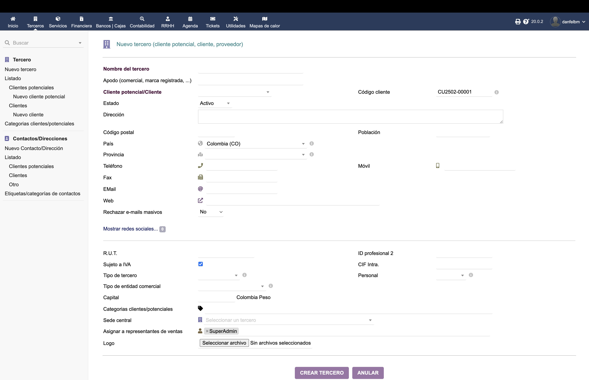
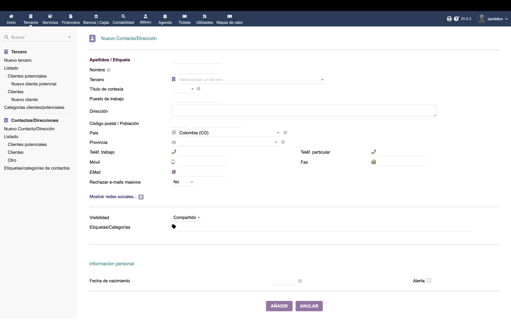
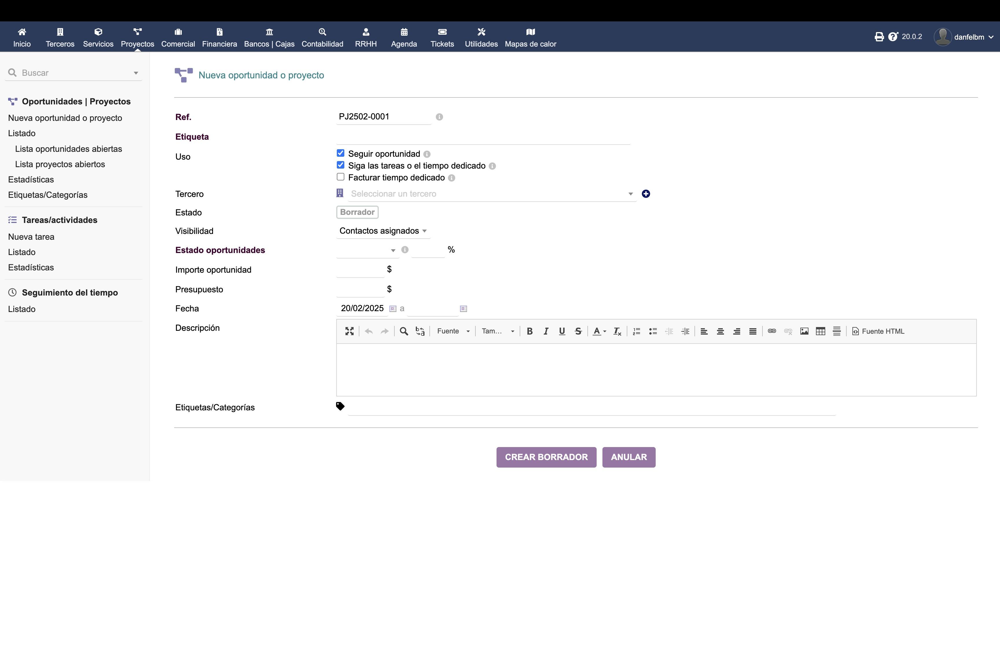
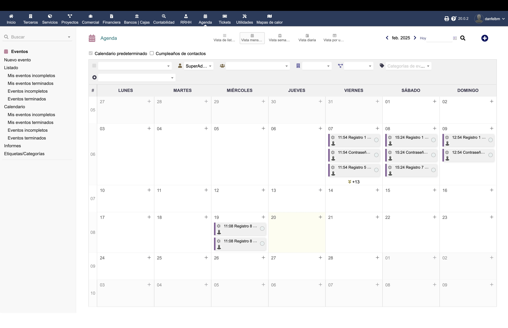
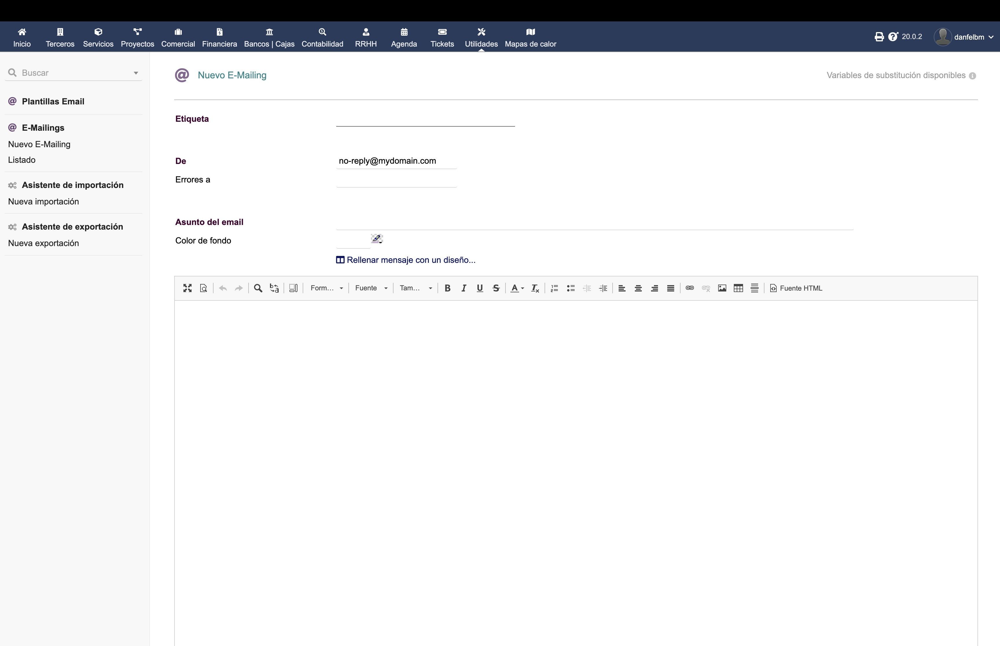

# Manual de Usuario - CRM Dolibarr Digital-IA

## Introducción

Este manual te guiará a través de las funcionalidades del CRM (Customer Relationship Management) de Dolibarr para el proyecto Digital-IA. El CRM te permitirá gestionar eficientemente las relaciones con alfabetizadores, participantes y colaboradores del programa.

## Módulos Principales del CRM

### 1. Gestión de Terceros
El módulo de terceros es la base del CRM, donde se registran todos los contactos y organizaciones.

#### Tipos de Terceros
- **Alfabetizadores**: Educadores del programa
- **Participantes**: Estudiantes y beneficiarios
- **Organizaciones**: Entidades colaboradoras
- **Proveedores**: Prestadores de servicios

#### Cómo crear un nuevo tercero:
1. Ve a "Terceros" > "Nuevo Tercero"
2. Selecciona el tipo:
   - Prospecto
   - Cliente/Participante
   - Cliente potencial
   - Proveedor
3. Completa la información básica:
   - Nombre/Razón social
   - Nombre comercial
   - Estado (activo/inactivo)
   - Código de tercero (se genera automáticamente)
   - Categoría del tercero

### 2. Gestión de Contactos
Los contactos son las personas específicas dentro de las organizaciones o terceros.

#### Crear nuevo contacto:
1. Accede a "Contactos/Direcciones" > "Nuevo contacto"
2. Ingresa:
   - Nombre y apellidos
   - Tercero relacionado
   - Cargo/Posición
   - Información de contacto:
     - Teléfono fijo
     - Móvil
     - Email
   - Etiquetas/Categorías

### 3. Gestión de Oportunidades
Seguimiento de oportunidades de colaboración y proyectos potenciales.

#### Crear nueva oportunidad:
1. Ve a "Proyectos" > "Nueva oportunidad"
2. Define:
   - Tercero relacionado
   - Importe estimado
   - Probabilidad de éxito
   - Fecha prevista de cierre
   - Estado:
     - Prospección
     - Calificación
     - Propuesta
     - Negociación
     - Ganada/Perdida

### 4. Agenda y Eventos
Gestión de actividades y seguimiento de interacciones.

#### Registrar nueva actividad:
1. Accede a "Agenda" > "Nuevo evento"
2. Especifica:
   - Tipo de evento:
     - Reunión
     - Llamada
     - Tarea
     - Email
   - Fecha y hora
   - Duración
   - Participantes
   - Notas y resultados

### 5. Campañas de Marketing
Gestión de campañas de comunicación y difusión.

#### Crear nueva campaña:
1. Ve a "Utilidades" > "Nueva campaña"
2. Define:
   - Nombre de la campaña
   - Público objetivo
   - Fechas de inicio/fin
   - Presupuesto
   - Canales:
     - Email
     - SMS
     - Redes sociales
   - Métricas de seguimiento

## Consejos y Mejores Prácticas

### 1. Organización de Datos
- Mantén la información actualizada
- Usa categorías y etiquetas consistentemente
- Documenta todas las interacciones importantes
- Establece campos obligatorios para datos críticos

### 2. Seguimiento de Actividades
- Programa recordatorios para seguimientos
- Registra resultados de interacciones
- Mantén un histórico de comunicaciones
- Asigna responsables para cada actividad

### 3. Gestión de Relaciones
- Personaliza la comunicación según el tipo de tercero
- Mantén un registro de preferencias y necesidades
- Establece protocolos de seguimiento
- Documenta acuerdos y compromisos

### 4. Seguridad y Privacidad
- Asigna permisos apropiados a usuarios
- Protege información sensible
- Cumple con normativas de protección de datos
- Realiza copias de seguridad regularmente

## Soporte y Ayuda

Si necesitas asistencia adicional:
1. Consulta la documentación oficial de Dolibarr
2. Contacta al equipo de soporte técnico
3. Revisa los tutoriales en línea
4. Participa en la comunidad de usuarios

---

*Nota: Este manual se actualizará periódicamente con nuevas funcionalidades y mejoras del sistema.*
