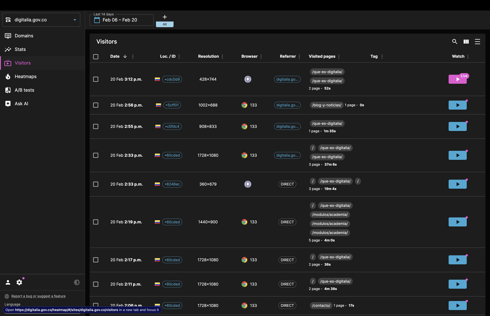

# Manual de Administrador - Panel de Análisis UXWizz

## Tabla de Contenidos

1. [Introducción](#introducción)
2. [Funcionalidades Principales](#funcionalidades-principales)
   - [Mapas de Calor](#mapas-de-calor)
   - [Lista de Visitantes](#lista-de-visitantes)
   - [Estadísticas y Gráficos](#estadísticas-y-gráficos)
   - [Segmentos de Usuarios](#segmentos-de-usuarios)
   - [Asistente AI](#asistente-ai)

## Introducción

UXWizz es una plataforma de análisis web autohospedada que te permite obtener información detallada sobre el tráfico de tu sitio web y mejorar la experiencia del usuario. Este manual te guiará a través de todas las funcionalidades principales de la plataforma.

## Funcionalidades Principales

### Grabación de Sesiones

UXWizz ofrece dos sistemas distintos de grabación de sesiones:

1. Sistema Ligero:
   - Menor uso de recursos
   - Ideal para sitios con alto tráfico
   - Captura eventos principales

2. Sistema Preciso:
   - Grabación detallada
   - Reproduce exactamente las acciones del usuario
   - Mayor uso de recursos

### Mapas de Calor

Los mapas de calor te permiten visualizar el comportamiento de los usuarios en tu sitio web.

#### Tipos de Mapas
1. Mapa de Clics:
   - Muestra dónde hacen clic los usuarios
   - Identifica elementos más utilizados
   - Detecta áreas de interés

2. Mapa de Movimientos:
   - Seguimiento del cursor
   - Patrones de lectura
   - Áreas de atención

3. Mapa de Desplazamiento:
   - Profundidad de scroll
   - Puntos de abandono
   - Visibilidad de contenido

### Lista de Visitantes

Accede a información detallada sobre cada visitante de tu sitio:

1. Datos Básicos:
   - País de origen
   - Dirección IP
   - Navegador y versión
   - Tamaño de pantalla

2. Comportamiento:
   - Duración de la visita
   - Páginas visitadas
   - Ruta de navegación
   - Eventos realizados

### Estadísticas y Gráficos

Panel de métricas principales con visualizaciones detalladas:

1. Métricas de Tráfico:
   - Visitantes únicos
   - Páginas vistas
   - Tasa de rebote
   - Duración de sesiones

2. Análisis de Fuentes:
   - Principales referentes
   - Páginas más visitadas
   - Distribución geográfica

### Segmentos de Usuarios

Crea y analiza grupos específicos de usuarios:

1. Crear Segmento:
   - Ve a "Segmentos" > "Nuevo Segmento"
   - Define criterios de segmentación:
     - Fuente de tráfico
     - Comportamiento
     - Datos demográficos
     - Eventos realizados

2. Análisis Comparativo:
   - Compara diferentes segmentos
   - Analiza conversiones por segmento
   - Exporta datos segmentados

### Asistente AI

Utiliza la integración con ChatGPT para analizar datos:

1. Consultas en Lenguaje Natural:
   - Pregunta sobre tus datos
   - Obtén consultas SQL automáticas
   - Análisis predictivo

2. Ejecución Local:
   - Queries directas a tu base de datos
   - Resultados en tiempo real
   - Personalización de consultas

## Consejos de Optimización

1. **Rendimiento**:
   - Utiliza el sistema de grabación ligero para sitios de alto tráfico
   - Configura la retención de datos según tus necesidades
   - Optimiza los eventos tracked para reducir el uso de base de datos

2. **Privacidad**:
   - Configura elementos sensibles para no ser grabados
   - Establece políticas de retención de datos
   - Cumple con GDPR y otras regulaciones

3. **Mejores Prácticas**:
   - Revisa las grabaciones regularmente
   - Utiliza segmentos para análisis específicos
   - Combina diferentes tipos de datos para insights más completos
