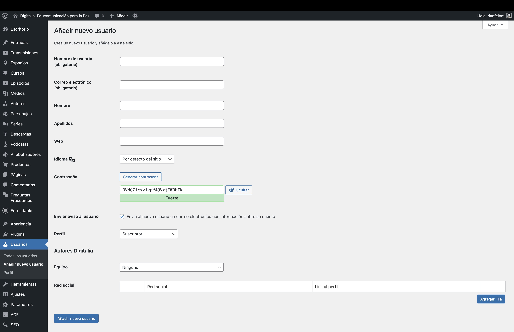
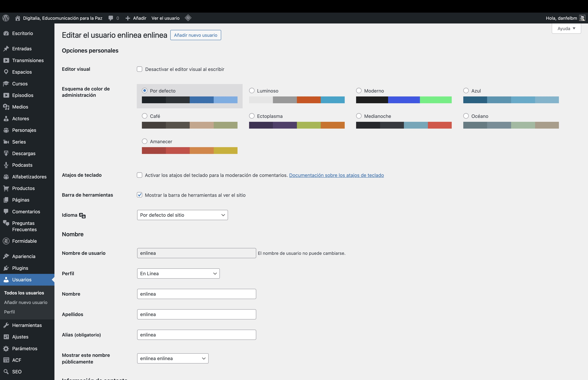
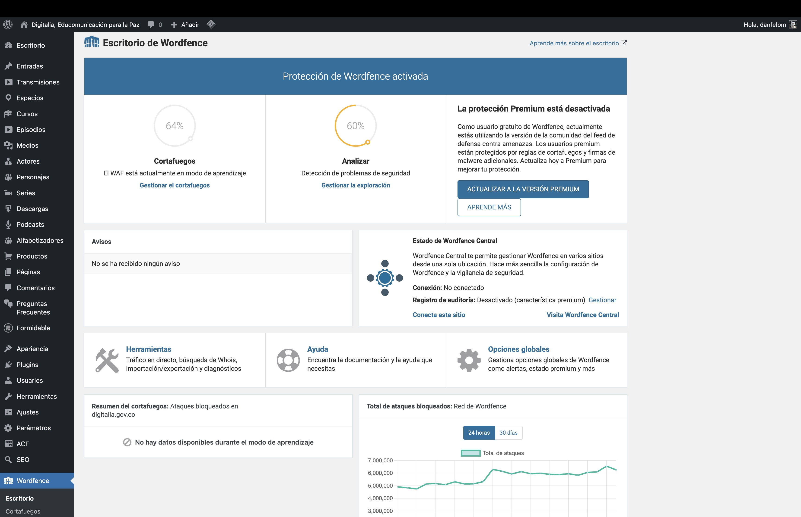
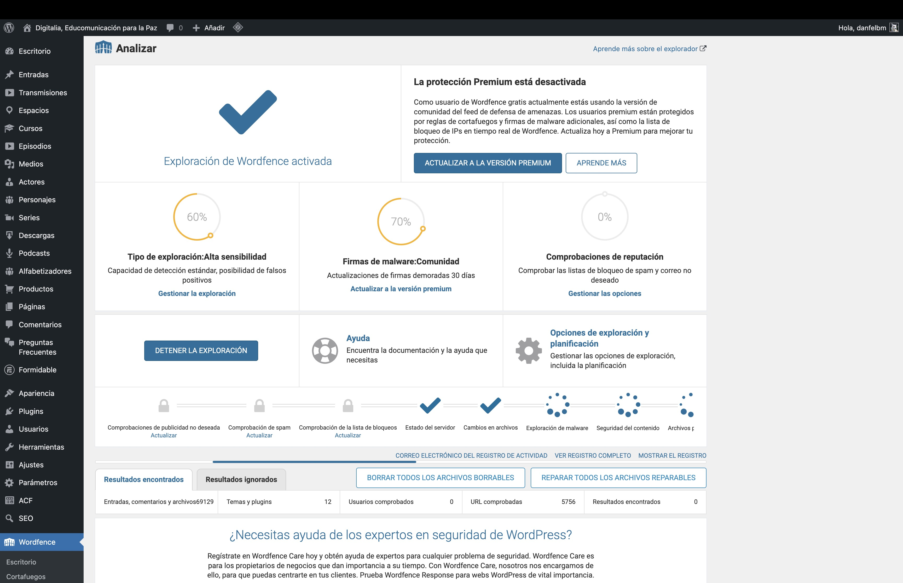
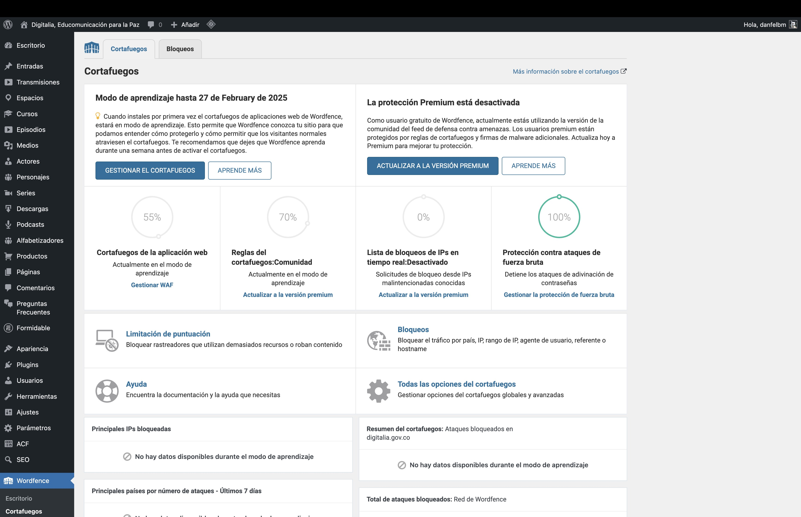
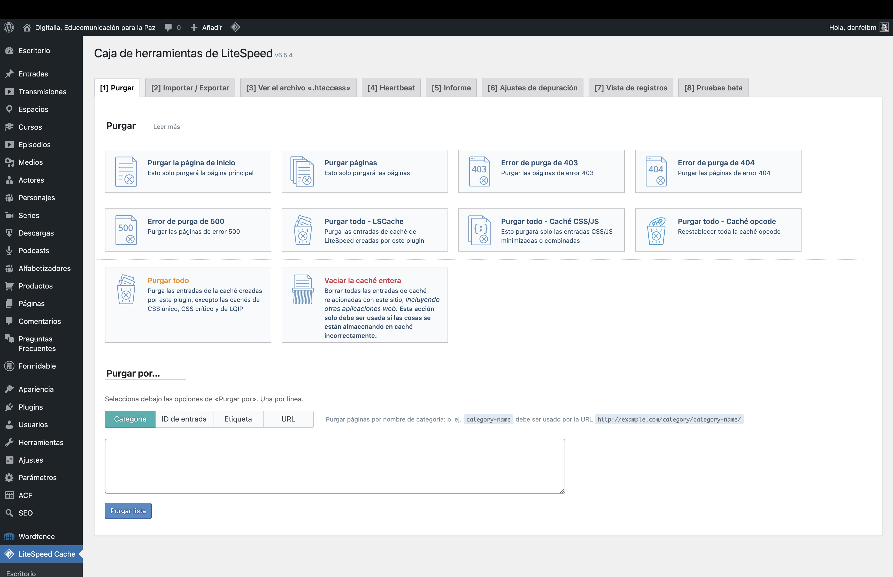
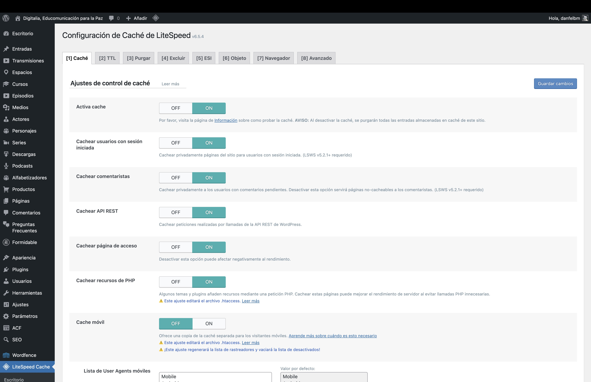

# Manual de Administrador - Panel de Administración WordPress Digital-IA

## Tabla de Contenidos

1. [Introducción](#introducción)
2. [Tipos de Contenido](#tipos-de-contenido)
   - [Episodios](#1-episodios)
   - [Actores y Personajes](#2-actores-y-personajes)
   - [Series](#3-series)
   - [Preguntas Frecuentes (FAQ)](#4-preguntas-frecuentes-faq)
   - [Descargas](#5-descargas)
   - [Podcasts y Transmisiones](#6-podcasts-y-transmisiones)
   - [Espacios](#7-espacios)
   - [Alfabetizadores](#8-alfabetizadores)
3. [Gestión General de WordPress](#gestión-general-de-wordpress)
   - [Gestión de Usuarios](#gestión-de-usuarios)
   - [Seguridad con Wordfence](#seguridad-con-wordfence)
   - [Optimización de Caché con LiteSpeed](#optimización-de-caché-con-litespeed)

## Introducción

Este manual te guiará a través del panel de administración de WordPress para el proyecto Digital-IA. Aquí podrás gestionar todos los tipos de contenido disponibles en la plataforma.

## Tipos de Contenido

### 1. Episodios
Los episodios son el componente principal de la serie web "En Línea con Digital-IA", una producción audiovisual que explora las intersecciones entre tecnología, sociedad y paz mediática. Cada episodio está cuidadosamente producido para ofrecer contenido educativo y entretenido que aborda los desafíos contemporáneos de la comunicación digital.

#### Cómo crear un nuevo episodio:
1. Ve a "Episodios" > "Añadir nuevo"
2. Completa la información:
   - Título del episodio
   - Contenido
   - Serie relacionada
   - Actores y personajes
   - Configuración de En Línea:
     - Video:
       - Botón de reproducción (activar/desactivar)
       - URL del video (formato embed de YouTube)
     - Título personalizado
     - Descripción (máximo 3 líneas)
     - Botón CTA:
       - Texto del botón
       - URL del botón
     - Texto de apoyo (ej: "Con el apoyo de Canal 13")
   - Menú de navegación:
     - La Historia
     - Ver Episodios
     - Personajes
     - Blog
   - Contenido Principal:
     - Título principal
     - Descripción
     - Imagen principal
     - Botón CTA adicional
   - Estadísticas (opcional):
     - Número
     - Etiqueta

### 2. Actores y Personajes
La gestión de actores y personajes es fundamental para mantener un registro organizado de los participantes en nuestras producciones audiovisuales. Este módulo permite documentar las biografías, roles y contribuciones de cada persona que da vida a nuestras historias y contenidos educativos.

#### Gestión de actores:
1. Accede a "Actores" > "Añadir nuevo"
2. Ingresa:
   - Nombre del actor
   - Biografía
   - Foto
   - Roles desempeñados

### 3. Series
Las series son colecciones temáticas de contenido audiovisual que abordan diferentes aspectos de la alfabetización mediática y la educomunicación. Cada serie está diseñada para ofrecer una narrativa coherente y progresiva que facilita el aprendizaje y la comprensión de temas complejos.

#### Crear una nueva serie:
1. Ve a "Series" > "Añadir nueva"
2. Define:
   - Título de la serie
   - Descripción
   - Imagen de portada
   - Episodios relacionados

### 4. Preguntas Frecuentes (FAQ)
La sección de Preguntas Frecuentes es una herramienta esencial para brindar soporte a nuestra comunidad. Aquí se centraliza la información más solicitada, facilitando el acceso rápido a respuestas sobre el uso de la plataforma, metodologías de aprendizaje y aspectos técnicos del programa.

#### Configuración de la página FAQ:
1. Encabezado de Página:
   - Título personalizado
   - Subtítulo informativo
   - Botón CTA (opcional):
     - Texto del botón (ej: "Contactar soporte")
     - URL del botón
   - Texto adicional para tarjeta de crédito (opcional)

2. Contenido FAQ:
   - Texto del Badge (ej: "FAQ")
   - Título principal
   - Descripción general

#### Añadir nueva FAQ:
1. Accede a "FAQ" > "Añadir nueva"
2. Ingresa:
   - Pregunta (título)
   - Respuesta detallada (contenido)
   - Categoría de FAQ
   - Orden de visualización
   - Estado de publicación

### 5. Descargas
El sistema de descargas permite compartir recursos educativos, guías metodológicas y materiales complementarios con nuestra comunidad. Esta sección está diseñada para gestionar una biblioteca digital de recursos, garantizando un acceso organizado y controlado a documentos importantes.

#### Subir nuevo recurso:
1. Ve a "Descargas" > "Añadir nueva"
2. Completa:
   - Título del recurso
   - Descripción
   - Archivo para descargar:
     - Formatos permitidos: PDF, DOC, DOCX, XLS, XLSX, PPT, PPTX, ZIP, RAR
   - Versión del documento (ej: 1.0)
   - Autor
   - Año de publicación
   - Idioma:
     - Español
     - Inglés
     - Portugués
     - Francés
   - Número de páginas
   - Licencia:
     - Creative Commons BY
     - Creative Commons BY-SA
     - Creative Commons BY-NC
     - Creative Commons BY-NC-SA
     - Creative Commons BY-ND
     - Creative Commons BY-NC-ND
     - Todos los derechos reservados
   - Estadísticas:
     - Número de descargas (automático)
     - Última actualización

### 6. Podcasts y Transmisiones
La sección de podcasts y transmisiones amplía nuestro alcance a través del contenido en audio y transmisiones en vivo. Este formato permite llegar a diferentes audiencias y estilos de aprendizaje, ofreciendo contenido educativo en un formato accesible y portable.

#### Crear nuevo podcast:
1. Accede a "Podcasts" > "Añadir nuevo"
2. Define:
   - Título del episodio
   - Descripción general
   - Resumen del episodio (opcional)
   - Duración del episodio (ej: "45:30" o "1h 15min")
   - Archivo de audio:
     - Formatos permitidos: MP3, M4A, WAV
     - Se recomienda formato MP3
   - Plataformas de distribución:
     - URL de Spotify
     - URL de Apple Podcasts
     - URL de Overcast
     - URL del Feed RSS
   - Número de episodio (opcional)
   - Número de temporada (opcional)
   - Transcripción del episodio (opcional)
   - Imagen destacada

### 7. Espacios
Los espacios representan los puntos de encuentro físicos y virtuales donde nuestra comunidad se reúne, aprende y colabora. Esta sección permite gestionar la información sobre las ubicaciones donde se desarrollan actividades presenciales y los entornos virtuales de aprendizaje.

#### Crear nuevo espacio:
1. Ve a "Espacios" > "Añadir nuevo"
2. Ingresa:
   - Nombre del espacio
   - Descripción detallada (requerido)
   - Texto introductorio (breve descripción)
   - Características:
     - Área (ej: 500 m²)
     - Capacidad (ej: 100 personas)
     - Características adicionales:
       - WiFi de alta velocidad
       - Estacionamiento
       - Accesibilidad universal
       - Zona de café
       - Aire acondicionado
       - Iluminación natural
       - Proyector
       - Sistema de sonido
       - Cocina equipada
       - Casilleros
       - Salas de reuniones
       - Área al aire libre
       - Estacionamiento de bicicletas
       - Seguridad 24/7
       - Servicios de impresión
       - Cabinas telefónicas
   - Horarios:
     - Lunes a Viernes
     - Sábados
     - Domingos
   - Información de Contacto:
     - Teléfono
     - Correo Electrónico
     - WhatsApp
   - Ubicación en el mapa (Google Maps)

### 8. Alfabetizadores
Los alfabetizadores son los agentes de cambio que lideran nuestros procesos educativos en el territorio. Este módulo permite gestionar los perfiles de estos educadores especializados, quienes son fundamentales para llevar la alfabetización mediática y digital a diferentes comunidades en Colombia.

#### Añadir nuevo alfabetizador:
1. Accede a "Alfabetizadores" > "Añadir nuevo"
2. Completa los siguientes campos:
   - Nombre del alfabetizador
   - Avatar (imagen cuadrada de al menos 400x400px)
   - Cargo o rol (requerido)
   - Etiquetas de Especialización (requerido)
   - Ubicación (selecciona hasta dos ubicaciones)
   - Especialidad principal (requerido)
   - Estado:
     - Activo
     - Inactivo
     - En formación
   - Sobre Mí (descripción detallada)
   - Experiencia:
     - Cargo
     - Período (año inicio - año fin)
     - Descripción
   - Proyectos Destacados:
     - Nombre del proyecto
     - Período
     - Descripción del proyecto

### 9. Productos
La sección de productos educativos abarca todos los recursos y materiales desarrollados por Digital-IA. Aquí se gestionan tanto los productos gratuitos como los de valor comercial, incluyendo cursos especializados, materiales didácticos y recursos pedagógicos.

#### Crear nuevo producto:
1. Ve a "Productos" > "Añadir nuevo"
2. Define:
   - Nombre del producto
   - Descripción
   - Precio (si aplica)
   - Categoría

## Gestión General de WordPress

### Gestión de Usuarios

La gestión de usuarios en WordPress es fundamental para mantener un control adecuado sobre quién tiene acceso al panel de administración y qué pueden hacer.

#### Añadir Nuevos Usuarios
1. Ve a "Usuarios" > "Añadir nuevo"
2. Completa la información requerida:
   - Nombre de usuario
   - Correo electrónico
   - Contraseña (o dejar que WordPress genere una segura)
   - Rol del usuario:
     - Administrador: acceso completo
     - Editor: gestión de contenido
     - Autor: publicación de contenido propio
     - Colaborador: crear contenido sin publicar
     - Suscriptor: solo lectura

#### Modificar Usuarios Existentes
1. Ve a "Usuarios" > "Todos los usuarios"
2. Haz clic en el usuario que deseas modificar
3. Puedes actualizar:
   - Información personal
   - Contraseña
   - Rol
   - Estado de la cuenta (activar/desactivar)

### Seguridad con Wordfence

Wordfence es nuestro plugin de seguridad principal. Aquí están las tareas principales de monitoreo:

#### Panel de Control de Wordfence
1. Accede a "Wordfence" en el menú lateral
2. Revisa el dashboard para:
   - Intentos de inicio de sesión fallidos
   - Bloqueos de IP
   - Amenazas detectadas
   - Estado del firewall

#### Análisis de Seguridad
1. Ve a "Wordfence" > "Analizar"
2. Ejecuta un escaneo completo:
   - Malware
   - Vulnerabilidades
   - Archivos modificados
   - Plugins desactualizados

#### Configuración de Firewall
1. Navega a "Wordfence" > "Firewall"
2. Revisa y ajusta:
   - Reglas de bloqueo
   - Lista negra de IPs
   - Protección de inicio de sesión
   - Bloqueo de países (si es necesario)

### Optimización de Caché con LiteSpeed

LiteSpeed Cache es esencial para mantener el sitio rápido y eficiente.

#### Purgar Caché
1. Ve a "LiteSpeed Cache" > "Herramientas"
2. Opciones de purga:
   - "Purgar Todo": limpia toda la caché
   - "Purgar por URLs": para páginas específicas
   - "Purgar por Posts": para entradas específicas

#### Configuración de Caché
1. Accede a "LiteSpeed Cache" > "Settings"
2. Secciones principales:
   - Cache: activar/desactivar caché general
   - TTL (Time To Live): duración de la caché
   - Exclusiones: URLs o tipos de contenido a excluir
   - Browser Cache: caché del navegador
   - Minificación: optimización de CSS/JS

## Consejos Generales

1. **Imágenes**:
   - Usa imágenes optimizadas para web
   - Dimensiones recomendadas: 1200x800px
   - Formato: JPG o PNG
   - Peso máximo: 500KB

2. **SEO**:
   - Completa siempre los campos de título y descripción
   - Usa palabras clave relevantes
   - Optimiza las URLs

3. **Contenido**:
   - Mantén un estilo consistente
   - Usa párrafos cortos
   - Incluye enlaces internos cuando sea relevante

4. **Medios**:
   - Organiza los archivos en carpetas
   - Usa nombres descriptivos
   - Completa los campos alt en las imágenes

## Soporte

Si necesitas ayuda adicional:
1. Consulta la sección de FAQ
2. Contacta al equipo de soporte técnico
3. Revisa la documentación en línea

---

*Nota: Este manual se actualizará periódicamente con nuevas funcionalidades y mejoras del sistema.*
